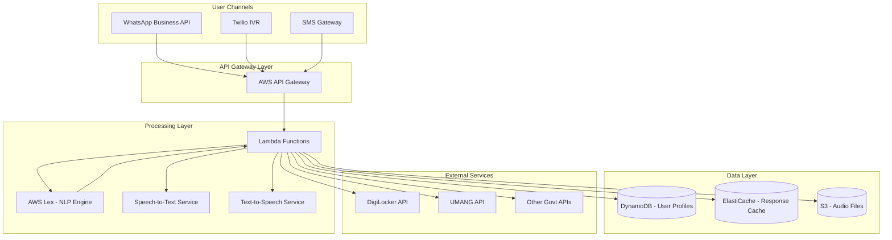
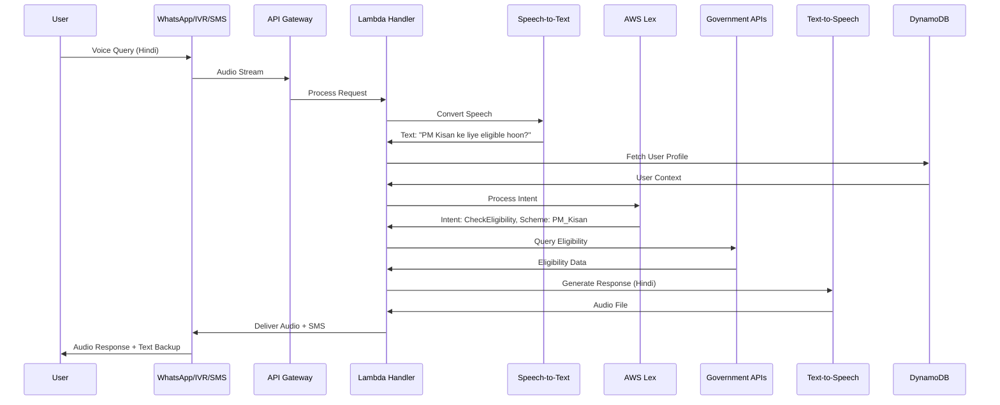

# Design Document: SarkarSahayak AI

## Overview

SarkarSahayak AI is a voice-first, multilingual assistant platform designed to bridge the digital divide for 600M+ rural Indians. The system provides natural language access to government schemes, local resources, and community tools through WhatsApp, IVR calls, and SMS. The architecture prioritizes voice interaction, offline capability, and hyper-localized content delivery to serve users with low literacy and limited internet connectivity.

### Design Goals

1. **Voice-First Experience**: Optimize for natural speech interaction in 10+ Indian languages with 90%+ accuracy for rural dialects
2. **Multi-Channel Accessibility**: Seamless experience across WhatsApp, IVR, and SMS with automatic fallback
3. **Offline Resilience**: Function in zero-data mode using SMS and cached responses
4. **Real-Time Integration**: Connect to government APIs (DigiLocker, UMANG) for accurate, up-to-date information
5. **Scalability**: Support 100K+ concurrent users with sub-5-second response times
6. **Privacy-First**: Encrypt user data, minimize collection, comply with Indian data protection regulations

### Key Technical Decisions

- **AWS Lex** for multilingual NLP with custom slot types for Indian schemes and regional terminology
- **Twilio IVR** for voice call handling with DTMF fallback
- **WhatsApp Business API** as primary channel for rich media and group sharing
- **Hugging Face Indic models** (AI4Bharat) for regional language speech recognition
- **AWS Polly** with Indian English and Hindi neural voices, supplemented by custom TTS for other languages
- **DynamoDB** for user profiles with single-digit millisecond latency
- **AWS Lambda** for serverless API integration with auto-scaling
- **CloudFront CDN** for audio file delivery with edge caching

## Architecture

### High-Level System Architecture



### Component Interaction Flow



## Components and Interfaces

### 1. Voice Interface Layer

#### WhatsApp Business API Integration

**Purpose**: Primary channel for voice messages, rich media, and group broadcasting

**Interface**:
```typescript
interface WhatsAppHandler {
  receiveVoiceMessage(audioUrl: string, userId: string, language: string): Promise<Response>
  sendAudioResponse(userId: string, audioUrl: string, transcript: string): Promise<void>
  sendMediaMessage(userId: string, mediaType: 'image' | 'location' | 'document', content: any): Promise<void>
  handleButtonResponse(userId: string, buttonId: string): Promise<Response>
}
```

**Key Features**:
- Webhook endpoint for incoming voice messages
- Audio file download and streaming
- Rich media support (images, location pins, documents)
- Interactive buttons for menu navigation
- Group message broadcasting with rate limiting

#### Twilio IVR Integration

**Purpose**: Voice call handling for users without WhatsApp

**Interface**:
```typescript
interface IVRHandler {
  handleIncomingCall(callSid: string, from: string): Promise<TwiMLResponse>
  processVoiceInput(callSid: string, speechResult: string): Promise<TwiMLResponse>
  processDTMFInput(callSid: string, digits: string): Promise<TwiMLResponse>
  playAudio(callSid: string, audioUrl: string): Promise<void>
  gatherInput(callSid: string, prompt: string, timeout: number): Promise<string>
}
```

**Key Features**:
- Language selection menu (1 for Hindi, 2 for Tamil, etc.)
- Speech recognition with Twilio's ASR
- DTMF fallback for poor audio quality
- Call recording for quality assurance
- Automatic retry on recognition failure

#### SMS Gateway

**Purpose**: Fallback channel for offline mode and text-based interaction

**Interface**:
```typescript
interface SMSHandler {
  receiveSMS(from: string, body: string): Promise<void>
  sendSMS(to: string, message: string): Promise<void>
  sendMultiPartSMS(to: string, longMessage: string): Promise<void>
  validateDelivery(messageId: string): Promise<DeliveryStatus>
}
```

**Key Features**:
- Unicode support for Indian languages
- Message splitting for long responses
- Delivery confirmation tracking
- Session management via SMS context

### 2. Speech Processing Layer

#### Speech-to-Text Service

**Purpose**: Convert voice input to text in regional languages

**Interface**:
```typescript
interface SpeechToTextService {
  transcribe(audioUrl: string, language: string, dialect?: string): Promise<TranscriptionResult>
  detectLanguage(audioUrl: string): Promise<string>
  improveAccuracy(audioUrl: string, expectedText: string): Promise<void>
}

interface TranscriptionResult {
  text: string
  confidence: number
  language: string
  dialect?: string
  alternatives?: Array<{text: string, confidence: number}>
}
```

**Implementation Strategy**:
- **Primary**: Google Speech-to-Text API with Indian language models
- **Secondary**: Hugging Face Indic models (AI4Bharat IndicWav2Vec) for regional dialects
- **Fallback**: AWS Transcribe for Hindi and English
- **Confidence threshold**: 0.85 for automatic processing, below triggers clarification

**Dialect Handling**:
- Maintain dialect mapping database (e.g., Bhojpuri → Hindi, Marwari → Hindi)
- Use acoustic model adaptation for common rural accents
- Implement custom vocabulary for scheme names and government terminology

#### Text-to-Speech Service

**Purpose**: Generate natural-sounding audio responses in regional languages

**Interface**:
```typescript
interface TextToSpeechService {
  synthesize(text: string, language: string, voice: VoiceProfile): Promise<AudioFile>
  adjustSpeed(audioUrl: string, speedFactor: number): Promise<AudioFile>
  addPauses(text: string, pauseLocations: number[]): string
}

interface VoiceProfile {
  language: string
  gender: 'male' | 'female'
  style: 'formal' | 'conversational'
  speed: number
}

interface AudioFile {
  url: string
  duration: number
  format: 'mp3' | 'wav'
  size: number
}
```

**Implementation Strategy**:
- **AWS Polly**: Hindi (Aditi), Tamil (coming), English-Indian (Raveena)
- **Google Cloud TTS**: Tamil, Telugu, Bengali, Marathi with WaveNet voices
- **Custom TTS**: Bhashini API for remaining Indian languages
- **Audio optimization**: 32kbps MP3 for bandwidth efficiency
- **Caching**: Pre-generate common responses, cache in S3 with CloudFront CDN

### 3. Natural Language Processing

#### AWS Lex Configuration

**Purpose**: Intent recognition and slot filling for user queries

**Interface**:
```typescript
interface LexNLPEngine {
  processText(text: string, userId: string, sessionAttributes: any): Promise<LexResponse>
  addCustomSlotType(slotName: string, values: string[]): Promise<void>
  trainModel(trainingData: Array<{utterance: string, intent: string}>): Promise<void>
}

interface LexResponse {
  intent: string
  slots: Record<string, string>
  confidence: number
  sessionAttributes: any
  dialogState: 'ElicitIntent' | 'ElicitSlot' | 'ConfirmIntent' | 'Fulfilled'
}
```

**Custom Intents**:
1. `CheckSchemeEligibility` - Slots: scheme_name, user_age, user_income, user_location
2. `FindNearbyResource` - Slots: resource_type, location, radius
3. `FileComplaint` - Slots: complaint_type, description, location
4. `ExplainRights` - Slots: right_category, context
5. `GetSchemeDetails` - Slots: scheme_name
6. `TrackApplication` - Slots: reference_number
7. `EmergencyHelp` - Slots: emergency_type, location

**Custom Slot Types**:
- `SchemeNames`: PM_Kisan, Ayushman_Bharat, PM_Awas_Yojana, MGNREGA, etc. (50+ schemes)
- `ResourceTypes`: clinic, hospital, job, market, bank, post_office, police_station
- `ComplaintTypes`: water, electricity, road, corruption, service_denial
- `RightCategories`: labor, land, welfare, education, health

**Multilingual Support**:
- Separate Lex bots for each language with shared intent structure
- Cross-language slot value mapping (e.g., "PM किसान" → "PM_Kisan")
- Fallback to English bot with translation layer

### 4. API Integration Layer

#### Lambda Function Architecture

**Purpose**: Orchestrate API calls, business logic, and response generation

**Core Functions**:

```typescript
// Main request handler
interface RequestHandler {
  handleRequest(event: APIGatewayEvent): Promise<APIGatewayResponse>
  routeToChannel(channel: 'whatsapp' | 'ivr' | 'sms', payload: any): Promise<void>
}

// Government API integration
interface GovernmentAPIClient {
  checkEligibility(scheme: string, userParams: UserParams): Promise<EligibilityResult>
  getSchemeDetails(schemeId: string): Promise<SchemeDetails>
  submitApplication(scheme: string, userData: ApplicationData): Promise<ApplicationResult>
  trackApplication(referenceNumber: string): Promise<ApplicationStatus>
  fileComplaint(complaint: ComplaintData): Promise<ComplaintResult>
}

interface UserParams {
  age?: number
  income?: number
  location: string
  category?: 'SC' | 'ST' | 'OBC' | 'General'
  landHolding?: number
  familySize?: number
}

interface EligibilityResult {
  eligible: boolean
  reasons: string[]
  requiredDocuments: string[]
  nextSteps: string[]
  alternativeSchemes?: string[]
}
```

**Government API Integrations**:

1. **DigiLocker API**
   - Purpose: Fetch user documents (Aadhaar, PAN, certificates)
   - Authentication: OAuth 2.0 with user consent
   - Endpoints: `/issued`, `/documents/{docId}`

2. **UMANG API**
   - Purpose: Access multiple government services
   - Authentication: API key + JWT
   - Services: Scheme applications, status tracking, payments

3. **State Government APIs**
   - Purpose: Local resource data, complaint systems
   - Varies by state, requires adapter pattern

**Error Handling**:
- Retry logic: 3 attempts with exponential backoff
- Circuit breaker: Open after 5 consecutive failures
- Fallback: Cached data with staleness indicator
- Timeout: 10 seconds for API calls

### 5. Data Management

#### User Profile Schema (DynamoDB)

```typescript
interface UserProfile {
  userId: string                    // Partition key: phone number
  createdAt: number                 // Sort key: timestamp
  preferredLanguage: string
  preferredChannel: 'whatsapp' | 'ivr' | 'sms'
  demographics: {
    age?: number
    location: string
    district: string
    state: string
    category?: string
  }
  interactionHistory: Array<{
    timestamp: number
    intent: string
    scheme?: string
    satisfied: boolean
  }>
  savedSchemes: string[]
  applicationReferences: Array<{
    scheme: string
    referenceNumber: string
    status: string
    submittedAt: number
  }>
  consentGiven: boolean
  dataRetentionExpiry: number
}
```

**Indexes**:
- GSI on `location` for regional analytics
- GSI on `preferredLanguage` for language usage tracking
- LSI on `createdAt` for user cohort analysis

#### Response Cache (ElastiCache Redis)

**Purpose**: Cache common responses and API results

**Cache Strategy**:
- Scheme details: TTL 24 hours
- Eligibility rules: TTL 12 hours
- Resource locations: TTL 6 hours
- Audio files: TTL 7 days
- User sessions: TTL 30 minutes

**Cache Keys**:
```
scheme:{schemeId}:details
eligibility:{schemeId}:{userHash}
resources:{type}:{location}:{radius}
audio:{language}:{textHash}
session:{userId}:{timestamp}
```

#### Audio File Storage (S3)

**Bucket Structure**:
```
sarkarsahayak-audio/
  ├── generated/
  │   ├── hindi/
  │   ├── tamil/
  │   └── telugu/
  ├── user-uploads/
  │   └── complaints/
  └── templates/
      ├── greetings/
      ├── menus/
      └── confirmations/
```

**Lifecycle Policies**:
- Generated audio: Delete after 7 days
- User uploads: Move to Glacier after 90 days
- Templates: Never expire

## Data Models

### Core Domain Models

```typescript
// Government Scheme
interface Scheme {
  id: string
  name: string
  nameTranslations: Record<string, string>
  description: string
  descriptionTranslations: Record<string, string>
  category: 'agriculture' | 'health' | 'housing' | 'employment' | 'education' | 'welfare'
  eligibilityCriteria: EligibilityCriteria
  benefits: string[]
  requiredDocuments: string[]
  applicationProcess: ApplicationStep[]
  deadlines?: {
    startDate: Date
    endDate: Date
  }
  contactInfo: ContactInfo
  officialUrl: string
}

interface EligibilityCriteria {
  minAge?: number
  maxAge?: number
  maxIncome?: number
  categories?: string[]
  location?: string[]
  landHolding?: {min?: number, max?: number}
  customRules?: Array<{field: string, operator: string, value: any}>
}

interface ApplicationStep {
  stepNumber: number
  description: string
  descriptionTranslations: Record<string, string>
  requiredDocuments: string[]
  estimatedTime: string
  helpUrl?: string
}

// Local Resource
interface Resource {
  id: string
  type: 'clinic' | 'hospital' | 'job' | 'market' | 'bank' | 'post_office' | 'police_station'
  name: string
  location: GeoLocation
  address: string
  addressTranslations: Record<string, string>
  contact: ContactInfo
  operatingHours: OperatingHours
  services: string[]
  accessibility: {
    wheelchairAccessible: boolean
    publicTransport: boolean
  }
  verifiedAt: Date
}

interface GeoLocation {
  latitude: number
  longitude: number
  district: string
  state: string
  pincode: string
}

interface ContactInfo {
  phone: string[]
  email?: string
  website?: string
  tollFreeNumber?: string
}

interface OperatingHours {
  monday: TimeSlot[]
  tuesday: TimeSlot[]
  wednesday: TimeSlot[]
  thursday: TimeSlot[]
  friday: TimeSlot[]
  saturday: TimeSlot[]
  sunday: TimeSlot[]
}

interface TimeSlot {
  open: string  // HH:MM format
  close: string
}

// Complaint
interface Complaint {
  id: string
  referenceNumber: string
  userId: string
  type: string
  description: string
  location: GeoLocation
  evidence: string[]  // S3 URLs for photos
  status: 'submitted' | 'acknowledged' | 'in_progress' | 'resolved' | 'rejected'
  submittedAt: Date
  updatedAt: Date
  assignedTo?: string
  resolution?: string
  resolutionDate?: Date
}

// Conversation Session
interface ConversationSession {
  sessionId: string
  userId: string
  channel: 'whatsapp' | 'ivr' | 'sms'
  language: string
  startedAt: Date
  lastActivityAt: Date
  context: SessionContext
  messages: Message[]
}

interface SessionContext {
  currentIntent?: string
  collectedSlots: Record<string, any>
  pendingConfirmation?: string
  retryCount: number
  fallbackMode: boolean
}

interface Message {
  timestamp: Date
  direction: 'inbound' | 'outbound'
  type: 'voice' | 'text' | 'media'
  content: string
  audioUrl?: string
  confidence?: number
}
```

### Analytics Models

```typescript
interface QueryAnalytics {
  date: Date
  region: string
  language: string
  intent: string
  scheme?: string
  count: number
  avgConfidence: number
  successRate: number
}

interface UserEngagement {
  date: Date
  newUsers: number
  returningUsers: number
  totalSessions: number
  avgSessionDuration: number
  channelBreakdown: Record<string, number>
  languageBreakdown: Record<string, number>
}

interface SchemePopularity {
  schemeId: string
  schemeName: string
  queries: number
  applications: number
  conversionRate: number
  topRegions: Array<{region: string, count: number}>
}
```


## Correctness Properties

*A property is a characteristic or behavior that should hold true across all valid executions of a system—essentially, a formal statement about what the system should do. Properties serve as the bridge between human-readable specifications and machine-verifiable correctness guarantees.*

### Property Reflection

After analyzing all acceptance criteria, I've identified several areas where properties can be consolidated:

- **Language consistency properties** (1.1, 1.4, 4.1) can be combined into a single property about language context preservation
- **Eligibility determination properties** (2.3, 2.5, 2.6) can be unified into one comprehensive eligibility response property
- **Resource search properties** (3.3, 3.6) can be combined into a single radius-based search property
- **Channel fallback properties** (5.1, 15.2) address the same behavior and can be unified
- **Message formatting properties** (5.4, 15.3) both deal with SMS character limits and can be combined
- **Encryption properties** (9.3, 13.2) can be unified into one data encryption property
- **Feedback collection properties** (19.1, 19.2, 19.3) can be combined into a comprehensive feedback handling property

### Core System Properties

#### Property 1: Language Context Preservation
*For any* conversation session, once a Regional_Language is detected or selected, all subsequent system responses within that session should use the same language for both text and audio output.

**Validates: Requirements 1.1, 1.4, 4.1**

#### Property 2: Speech Recognition Error Recovery
*For any* audio input where speech-to-text confidence is below 0.85, the system should return a retry prompt in the user's language rather than proceeding with low-confidence interpretation.

**Validates: Requirements 1.3**

#### Property 3: Intent and Entity Extraction
*For any* user query about government schemes, the NLP engine should extract at minimum the scheme name or category, and return an error only when the query is genuinely ambiguous or off-topic.

**Validates: Requirements 2.1**

#### Property 4: API Parameter Mapping
*For any* identified scheme eligibility query, the API call should include all user parameters that are relevant to that scheme's eligibility criteria (age, income, location, etc.).

**Validates: Requirements 2.2**

#### Property 5: Eligibility Response Completeness
*For any* eligibility determination, the response should include: (1) eligible/not eligible status, (2) reasons for the determination, and (3) either enrollment steps (if eligible) or alternative schemes (if not eligible).

**Validates: Requirements 2.3, 2.5, 2.6**

#### Property 6: Multi-Scheme Result Ordering
*For any* query matching multiple schemes, the results should be ordered by eligibility likelihood (eligible schemes first, then partially eligible, then not eligible), and all matching schemes should be included.

**Validates: Requirements 2.4**

#### Property 7: Resource Type and Location Extraction
*For any* resource discovery query, the system should extract both the resource type (clinic, job, market, etc.) and location (explicit or from user profile), prompting for missing information.

**Validates: Requirements 3.1, 3.2**

#### Property 8: Radius-Based Resource Search
*For any* resource search with a specified location, the system should first search within 5km radius, and if no results are found, automatically expand to 20km and inform the user of the expanded search.

**Validates: Requirements 3.3, 3.6**

#### Property 9: Resource Response Format
*For any* successful resource search, the response should include audio directions with local landmarks, and for WhatsApp channel, should also include a map image with location pin.

**Validates: Requirements 3.4, 3.5**

#### Property 10: Audio Response Segmentation
*For any* text response that would generate audio longer than 60 seconds, the system should split it into segments of maximum 60 seconds each, with pause prompts between segments.

**Validates: Requirements 4.2**

#### Property 11: Technical Term Simplification
*For any* response containing government or technical terminology, the system should replace terms with simplified local language equivalents from the terminology dictionary.

**Validates: Requirements 4.3**

#### Property 12: Channel Fallback on Failure
*For any* voice delivery failure (WhatsApp or IVR), the system should automatically retry delivery via SMS within 30 seconds, maintaining the same conversation context.

**Validates: Requirements 5.1, 15.2**

#### Property 13: SMS Message Length Compliance
*For any* response delivered via SMS, each message part should not exceed 160 characters (for English) or 70 characters (for Unicode Indian languages), with multi-part messages numbered sequentially.

**Validates: Requirements 5.4, 15.3**

#### Property 14: SMS Session Context Preservation
*For any* SMS conversation, the system should maintain context (intent, collected slots, user profile) across multiple messages within a 30-minute window, treating them as a single session.

**Validates: Requirements 5.5**

#### Property 15: Complaint Reference Number Uniqueness
*For any* two complaint submissions, the generated reference numbers should be unique, following the format: STATE-DISTRICT-YYYYMMDD-SEQUENCE (e.g., MH-PUNE-20240115-00123).

**Validates: Requirements 6.2**

#### Property 16: Complaint Multi-Channel Confirmation
*For any* successfully submitted complaint, the system should send confirmation through both audio (if voice channel) and SMS, both containing the same unique reference number.

**Validates: Requirements 6.4**

#### Property 17: Complaint Status Retrieval
*For any* valid complaint reference number, the system should retrieve and return the current status, last update timestamp, and assigned officer (if available).

**Validates: Requirements 6.5**

#### Property 18: Rights Category Classification
*For any* query about rights or entitlements, the NLP engine should classify it into one of the defined categories (labor, land, welfare, education, health) or return a clarification prompt if ambiguous.

**Validates: Requirements 7.1**

#### Property 19: Rights Response Actionability
*For any* rights explanation response, the content should include both the right description and concrete steps on how to claim or exercise that right.

**Validates: Requirements 7.5**

#### Property 20: Shareable Message Formatting
*For any* information sharing request, the generated message should include: (1) clear heading, (2) bullet-pointed content, (3) both clickable URLs and SMS access codes for links, and (4) highlighted deadlines if present.

**Validates: Requirements 8.1, 8.2, 8.3, 8.4**

#### Property 21: First-Time User Profile Creation
*For any* user interacting for the first time (new phone number), the system should create a User_Profile with at minimum: userId, createdAt, preferredLanguage, and preferredChannel.

**Validates: Requirements 9.1**

#### Property 22: Returning User Personalization
*For any* returning user (existing User_Profile), the system should greet them in their stored preferredLanguage and prioritize scheme results based on their demographic profile.

**Validates: Requirements 9.2, 9.4**

#### Property 23: PII Encryption at Rest
*For any* user data stored in DynamoDB, all personally identifiable information fields (phone number, location, demographics) should be encrypted using AES-256 encryption.

**Validates: Requirements 9.3, 13.2**

#### Property 24: Data Retention Policy Enforcement
*For any* user interaction record, the system should automatically delete records older than 90 days, except for anonymized analytics data.

**Validates: Requirements 9.6**

#### Property 25: Government API Authentication
*For any* call to Government_API endpoints (DigiLocker, UMANG), the request should include a valid OAuth 2.0 token or API key that expires within 1 hour of issuance.

**Validates: Requirements 10.1, 13.3**

#### Property 26: API Response Validation
*For any* Government_API response, the system should validate that required fields are present and data types match expected schema before processing, falling back to cache if validation fails.

**Validates: Requirements 10.2**

#### Property 27: API Unavailability Fallback
*For any* Government_API call that times out or returns 5xx error, the system should serve cached data (if available) and include a staleness indicator in the response to the user.

**Validates: Requirements 10.3**

#### Property 28: API Rate Limit Handling
*For any* Government_API call that returns a 429 (rate limit) error, the system should queue the request and inform the user of the expected wait time based on rate limit reset time.

**Validates: Requirements 10.4**

#### Property 29: IVR Menu Routing
*For any* IVR menu selection (DTMF digit or voice command), the system should route to the corresponding conversation flow: 1→schemes, 2→resources, 3→complaints, 4→rights.

**Validates: Requirements 11.3**

#### Property 30: DTMF Input Support
*For any* IVR interaction point requiring user input, the system should accept both voice commands and DTMF digit input, treating them equivalently.

**Validates: Requirements 11.6**

#### Property 31: Request Prioritization Under Load
*For any* system state where resource utilization exceeds 80%, the system should prioritize requests in order: emergency queries, scheme eligibility, complaints, then other requests.

**Validates: Requirements 12.5**

#### Property 32: Data Minimization
*For any* user data collection point, the system should request only fields that are strictly necessary for the current operation, with optional fields clearly marked.

**Validates: Requirements 13.1**

#### Property 33: User Data Deletion
*For any* user opt-out or deletion request, the system should remove all personal data from DynamoDB, S3, and caches within 48 hours, retaining only anonymized analytics.

**Validates: Requirements 9.5, 13.6**

#### Property 34: Anonymized Analytics Logging
*For any* user interaction logged for analytics, the data should not contain phone numbers, names, or other PII, using only hashed user IDs and aggregated demographics.

**Validates: Requirements 14.1, 14.6**

#### Property 35: Analytics Aggregation Dimensions
*For any* analytics report generation, the data should be aggregated by at least three dimensions: region (district/state), scheme type, and time period (daily/weekly/monthly).

**Validates: Requirements 14.2**

#### Property 36: Low-Awareness Scheme Flagging
*For any* scheme that receives fewer than 10 queries per 100,000 users in its target region over a 30-day period, the system should flag it as low-awareness for outreach campaigns.

**Validates: Requirements 14.4**

#### Property 37: Complaint Resolution Tracking
*For any* complaint in the system, the resolution rate metric should be calculated as: (resolved complaints / total complaints) grouped by complaint type and region.

**Validates: Requirements 14.5**

#### Property 38: Active Channel Message Delivery
*For any* outbound message, the system should deliver it via the channel the user is currently active on, determined by the most recent inbound message within the last 30 minutes.

**Validates: Requirements 15.1**

#### Property 39: WhatsApp Rich Media Inclusion
*For any* response sent via WhatsApp that includes location data, the message should contain both a location pin (latitude/longitude) and an audio description of directions.

**Validates: Requirements 15.4**

#### Property 40: Cross-Channel Context Preservation
*For any* user who switches from one channel (e.g., WhatsApp) to another (e.g., SMS) mid-conversation, the system should maintain the conversation context including intent, collected slots, and conversation history.

**Validates: Requirements 15.5**

#### Property 41: Delivery Retry Logic
*For any* message delivery failure, the system should retry up to 3 times with exponential backoff (30s, 60s, 120s), then mark as failed and alert administrators.

**Validates: Requirements 15.6**

#### Property 42: Local Expression Mapping
*For any* user input containing regional expressions or colloquialisms, the NLP engine should map them to standard intents using the dialect dictionary before processing.

**Validates: Requirements 16.3**

#### Property 43: Low Confidence Clarification
*For any* NLP processing result with confidence below 0.70, the system should ask a clarifying question rather than proceeding with the low-confidence interpretation.

**Validates: Requirements 16.4**

#### Property 44: Dialect-Appropriate Response Vocabulary
*For any* response generated for a user with a detected dialect, the system should use vocabulary and expressions appropriate to that dialect from the dialect response templates.

**Validates: Requirements 16.6**

#### Property 45: Emergency Keyword Priority
*For any* user input containing emergency keywords (ambulance, police, fire, medical emergency, accident), the system should immediately set priority flag and bypass normal conversation flow.

**Validates: Requirements 17.1, 17.6**

#### Property 46: Emergency Contact Provision
*For any* emergency intent detection, the response should include: (1) nearest emergency service phone numbers, (2) user's current location (if available), and (3) a unique emergency reference ID.

**Validates: Requirements 17.2, 17.4**

#### Property 47: Emergency Location Sharing Consent
*For any* emergency situation where location sharing is possible, the system should explicitly request user consent before sharing location with emergency services, defaulting to "yes" after 5 seconds of silence.

**Validates: Requirements 17.3**

#### Property 48: Application Document Guidance
*For any* scheme application assistance request, the response should include: (1) complete list of required documents, (2) instructions for obtaining each document, and (3) DigiLocker integration option if user has access.

**Validates: Requirements 18.1, 18.2, 18.3**

#### Property 49: Complex Application Task Decomposition
*For any* scheme application with more than 5 steps, the system should break it into smaller tasks with checkpoints, presenting one task at a time and confirming completion before proceeding.

**Validates: Requirements 18.4**

#### Property 50: Application Submission Confirmation
*For any* completed scheme application submission, the response should include: (1) confirmation message, (2) unique tracking reference number, (3) expected processing timeline, and (4) how to check status.

**Validates: Requirements 18.5**

#### Property 51: Application Deadline Reminders
*For any* pending application with a deadline within 7 days, the system should send a reminder via the user's preferred channel at 7 days, 3 days, and 1 day before the deadline.

**Validates: Requirements 18.6**

#### Property 52: Conversation Feedback Collection
*For any* conversation that reaches a terminal state (completed intent or user goodbye), the system should request binary feedback (satisfied/not satisfied) via voice prompt or button.

**Validates: Requirements 19.1**

#### Property 53: Negative Feedback Follow-Up
*For any* negative feedback received, the system should immediately ask an open-ended follow-up question to collect specific issues, storing both the rating and the detailed feedback with conversation context.

**Validates: Requirements 19.2, 19.3**

#### Property 54: Feedback Pattern Alerting
*For any* 24-hour period where negative feedback rate exceeds 30% for a specific intent or scheme, the system should generate an alert to administrators with details of the issue pattern.

**Validates: Requirements 19.4**

#### Property 55: User Suggestion Acknowledgment
*For any* user input classified as a suggestion or feature request, the system should acknowledge receipt, thank the user, and log the suggestion with user demographics for prioritization analysis.

**Validates: Requirements 19.6**

#### Property 56: Audio-Only Feature Completeness
*For any* system feature or capability, it should be fully accessible through audio-only interaction without requiring visual elements, with all options clearly enumerated in audio.

**Validates: Requirements 20.1, 20.2**

#### Property 57: Multi-Modal Confirmation Input
*For any* system prompt requiring user confirmation, the system should accept input via voice commands ("yes"/"no"), DTMF (1 for yes, 2 for no), or button press (for WhatsApp).

**Validates: Requirements 20.3**

#### Property 58: Error Message Recovery Guidance
*For any* error condition encountered, the error message should include: (1) what went wrong in simple terms, (2) what the user can do to recover, and (3) option to speak with a human operator.

**Validates: Requirements 20.4**

#### Property 59: Speech Rate Adjustment
*For any* user request to slow down or speed up speech, the system should adjust TTS speed by ±25% and maintain that preference for the remainder of the session.

**Validates: Requirements 20.5**

#### Property 60: Complex Navigation Assistance
*For any* conversation flow with more than 3 decision points, the system should offer to repeat instructions after each step and provide a "start over" option at any point.

**Validates: Requirements 20.6**


## Error Handling

### Error Categories and Strategies

#### 1. Speech Recognition Errors

**Scenarios**:
- Low audio quality or background noise
- Unsupported language or dialect
- Incomplete or truncated audio

**Handling**:
```typescript
interface SpeechRecognitionError {
  type: 'low_confidence' | 'audio_quality' | 'unsupported_language' | 'timeout'
  confidence?: number
  detectedLanguage?: string
}

function handleSpeechError(error: SpeechRecognitionError, context: SessionContext): Response {
  if (error.type === 'low_confidence' && error.confidence < 0.85) {
    return {
      message: "I couldn't understand that clearly. Could you please repeat?",
      action: 'retry',
      retryCount: context.retryCount + 1
    }
  }
  
  if (context.retryCount >= 3) {
    return {
      message: "I'm having trouble understanding. Let me switch you to text mode.",
      action: 'fallback_to_sms'
    }
  }
  
  // Continue with retry logic
}
```

**Fallback Chain**:
1. Request user to repeat (up to 3 times)
2. Offer DTMF input (for IVR)
3. Switch to SMS mode
4. Escalate to human operator

#### 2. NLP Intent Recognition Errors

**Scenarios**:
- Ambiguous user input
- Out-of-scope queries
- Multiple possible intents

**Handling**:
```typescript
function handleNLPError(lexResponse: LexResponse, userInput: string): Response {
  if (lexResponse.confidence < 0.70) {
    return {
      message: "I'm not sure I understood. Are you asking about: [list top 2 intents]?",
      action: 'clarify_intent',
      options: lexResponse.alternatives
    }
  }
  
  if (lexResponse.intent === 'FallbackIntent') {
    return {
      message: "I can help you with government schemes, finding resources, filing complaints, or understanding your rights. What would you like to know?",
      action: 'present_menu'
    }
  }
}
```

**Strategies**:
- Present top 2-3 intent options for user selection
- Provide examples of supported queries
- Offer main menu navigation
- Log out-of-scope queries for future feature planning

#### 3. Government API Errors

**Scenarios**:
- API timeout or unavailability
- Rate limiting
- Authentication failures
- Invalid or incomplete data

**Handling**:
```typescript
interface APIErrorHandler {
  handleTimeout(apiName: string, cacheKey: string): Promise<Response>
  handleRateLimit(apiName: string, resetTime: number): Promise<Response>
  handleAuthError(apiName: string): Promise<Response>
  handleInvalidData(apiName: string, validationErrors: string[]): Promise<Response>
}

async function handleAPIError(error: APIError, request: APIRequest): Promise<Response> {
  // Circuit breaker pattern
  if (circuitBreaker.isOpen(error.apiName)) {
    return serveCachedData(request.cacheKey, {
      staleness: 'using_cached_data',
      message: 'Using recent data as the service is temporarily unavailable'
    })
  }
  
  // Retry with exponential backoff
  if (error.type === 'timeout' && request.retryCount < 3) {
    await delay(Math.pow(2, request.retryCount) * 1000)
    return retryAPICall(request)
  }
  
  // Rate limiting
  if (error.type === 'rate_limit') {
    return {
      message: `High demand right now. Your request is queued. Expected wait: ${error.resetTime} seconds`,
      action: 'queue_request',
      queuePosition: await getQueuePosition(request)
    }
  }
  
  // Authentication errors - refresh token
  if (error.type === 'auth_error') {
    await refreshAuthToken(error.apiName)
    return retryAPICall(request)
  }
  
  // Fallback to cached data
  return serveCachedData(request.cacheKey, {
    staleness: 'recent_data',
    message: 'Using recent information as current data is unavailable'
  })
}
```

**Circuit Breaker Configuration**:
- Failure threshold: 5 consecutive failures
- Timeout: 10 seconds
- Reset timeout: 60 seconds
- Half-open state: Allow 1 test request

#### 4. Channel Delivery Errors

**Scenarios**:
- WhatsApp delivery failure
- SMS delivery failure
- IVR call drop
- Network connectivity issues

**Handling**:
```typescript
async function handleDeliveryError(
  message: OutboundMessage,
  error: DeliveryError,
  attempt: number
): Promise<void> {
  // Automatic channel fallback
  if (error.channel === 'whatsapp' && attempt === 1) {
    await deliverViaSMS(message)
    return
  }
  
  // Retry logic with exponential backoff
  if (attempt < 3) {
    const delay = Math.pow(2, attempt) * 30000 // 30s, 60s, 120s
    await scheduleRetry(message, delay)
    return
  }
  
  // Final failure - alert and log
  await alertAdministrators({
    type: 'delivery_failure',
    userId: message.userId,
    channel: error.channel,
    attempts: attempt,
    message: message.content
  })
  
  await logFailedDelivery(message, error)
}
```

**Delivery Guarantees**:
- At-least-once delivery for critical messages (confirmations, emergency)
- Best-effort for informational messages
- Automatic fallback: WhatsApp → SMS → Voice call
- Delivery confirmation tracking

#### 5. Data Validation Errors

**Scenarios**:
- Invalid user input (malformed phone numbers, invalid dates)
- Missing required fields
- Data type mismatches

**Handling**:
```typescript
interface ValidationError {
  field: string
  value: any
  rule: string
  message: string
}

function handleValidationError(errors: ValidationError[], context: SessionContext): Response {
  const firstError = errors[0]
  
  return {
    message: `I need a valid ${firstError.field}. ${firstError.message}`,
    action: 'elicit_slot',
    slot: firstError.field,
    examples: getExamplesForField(firstError.field)
  }
}

// Example validation rules
const validationRules = {
  phone: /^[6-9]\d{9}$/,
  pincode: /^\d{6}$/,
  age: (value: number) => value >= 0 && value <= 120,
  income: (value: number) => value >= 0
}
```

**User-Friendly Error Messages**:
- Avoid technical jargon
- Provide examples of valid input
- Offer alternative input methods
- Use local language and context

#### 6. Session Management Errors

**Scenarios**:
- Session timeout
- Context loss
- Concurrent session conflicts

**Handling**:
```typescript
async function handleSessionError(error: SessionError, userId: string): Promise<Response> {
  if (error.type === 'timeout') {
    // Attempt to restore from last checkpoint
    const lastCheckpoint = await getLastCheckpoint(userId)
    
    if (lastCheckpoint && isRecent(lastCheckpoint, 5 * 60 * 1000)) {
      return {
        message: "Welcome back! Let's continue where we left off.",
        action: 'restore_session',
        context: lastCheckpoint.context
      }
    }
    
    return {
      message: "Your session timed out. Let's start fresh. How can I help you?",
      action: 'new_session'
    }
  }
  
  if (error.type === 'context_loss') {
    return {
      message: "I lost track of our conversation. Could you tell me again what you need help with?",
      action: 'restart_conversation'
    }
  }
}
```

**Session Checkpoints**:
- Save context after each completed intent
- Checkpoint before API calls
- Store in Redis with 30-minute TTL
- Restore on session recovery

#### 7. Emergency Handling Errors

**Scenarios**:
- Emergency service contact unavailable
- Location detection failure
- Critical system failure during emergency

**Handling**:
```typescript
async function handleEmergencyError(error: EmergencyError, context: EmergencyContext): Promise<Response> {
  // Emergency errors have highest priority - never fail silently
  
  if (error.type === 'contact_unavailable') {
    // Provide multiple fallback numbers
    return {
      message: "Primary emergency number unavailable. Try these alternatives:",
      contacts: [
        { service: 'National Emergency', number: '112' },
        { service: 'Police', number: '100' },
        { service: 'Ambulance', number: '108' },
        { service: 'Fire', number: '101' }
      ],
      action: 'provide_fallback_contacts'
    }
  }
  
  if (error.type === 'location_failure') {
    return {
      message: "I couldn't detect your location. Please tell me your village or nearest landmark.",
      action: 'elicit_location_manually',
      urgent: true
    }
  }
  
  // Critical failure - immediate escalation
  await alertEmergencyTeam({
    userId: context.userId,
    error: error,
    timestamp: new Date(),
    priority: 'CRITICAL'
  })
}
```

**Emergency Error Principles**:
- Never leave user without information
- Provide multiple fallback options
- Immediate human escalation for critical failures
- Log all emergency interactions for audit

### Error Logging and Monitoring

```typescript
interface ErrorLog {
  timestamp: Date
  errorType: string
  errorMessage: string
  userId: string
  sessionId: string
  context: any
  stackTrace?: string
  severity: 'low' | 'medium' | 'high' | 'critical'
}

async function logError(error: Error, context: any): Promise<void> {
  const errorLog: ErrorLog = {
    timestamp: new Date(),
    errorType: error.constructor.name,
    errorMessage: error.message,
    userId: context.userId,
    sessionId: context.sessionId,
    context: sanitizeContext(context),
    stackTrace: error.stack,
    severity: determineSeverity(error)
  }
  
  // Log to CloudWatch
  await cloudWatchLogger.log(errorLog)
  
  // Alert on critical errors
  if (errorLog.severity === 'critical') {
    await alertAdministrators(errorLog)
  }
  
  // Track error metrics
  await metricsCollector.increment(`errors.${errorLog.errorType}`)
}
```

**Monitoring Alerts**:
- Error rate > 5% of requests
- Critical errors (emergency handling, data loss)
- API circuit breaker opens
- Delivery failure rate > 10%
- Session timeout rate > 20%

## Testing Strategy

### Dual Testing Approach

The SarkarSahayak AI system requires both unit testing and property-based testing to ensure comprehensive correctness:

- **Unit tests**: Validate specific examples, edge cases, error conditions, and integration points
- **Property tests**: Verify universal properties hold across all possible inputs through randomization

Both approaches are complementary and necessary. Unit tests catch concrete bugs in specific scenarios, while property tests verify general correctness across the input space.

### Property-Based Testing

#### Framework Selection

**For TypeScript/JavaScript**: fast-check
- Mature library with excellent TypeScript support
- Rich set of built-in generators (arbitraries)
- Shrinking support for minimal failing examples
- Integration with Jest/Mocha

**For Python**: Hypothesis
- Industry-standard property testing library
- Powerful data generation strategies
- Excellent error reporting
- Integration with pytest

#### Configuration

Each property test MUST:
- Run minimum 100 iterations (due to randomization)
- Include a comment tag referencing the design property
- Use appropriate generators for Indian context (phone numbers, languages, locations)

**Tag Format**:
```typescript
// Feature: sarkarsahayak-ai, Property 1: Language Context Preservation
test('language context is preserved throughout session', () => {
  fc.assert(
    fc.property(
      fc.record({
        language: fc.constantFrom('hindi', 'tamil', 'telugu', 'bengali'),
        messages: fc.array(fc.string(), { minLength: 2, maxLength: 10 })
      }),
      async ({ language, messages }) => {
        const session = await createSession(language)
        
        for (const message of messages) {
          const response = await processMessage(session.id, message)
          expect(response.language).toBe(language)
        }
      }
    ),
    { numRuns: 100 }
  )
})
```

#### Custom Generators for Indian Context

```typescript
// Phone number generator (Indian format)
const indianPhoneNumber = fc.integer({ min: 6000000000, max: 9999999999 })
  .map(n => n.toString())

// Regional language generator
const regionalLanguage = fc.constantFrom(
  'hindi', 'tamil', 'telugu', 'bengali', 'marathi', 
  'gujarati', 'kannada', 'malayalam', 'punjabi', 'odia'
)

// Indian location generator
const indianLocation = fc.record({
  state: fc.constantFrom('Maharashtra', 'Tamil Nadu', 'Karnataka', 'UP', 'Bihar'),
  district: fc.string({ minLength: 3, maxLength: 20 }),
  pincode: fc.integer({ min: 100000, max: 999999 }).map(n => n.toString())
})

// Scheme name generator
const schemeName = fc.constantFrom(
  'PM_Kisan', 'Ayushman_Bharat', 'PM_Awas_Yojana', 'MGNREGA',
  'Ujjwala_Yojana', 'Sukanya_Samriddhi', 'Atal_Pension'
)

// User demographics generator
const userDemographics = fc.record({
  age: fc.integer({ min: 18, max: 80 }),
  income: fc.integer({ min: 0, max: 1000000 }),
  category: fc.constantFrom('SC', 'ST', 'OBC', 'General'),
  landHolding: fc.option(fc.double({ min: 0, max: 50 }))
})
```

#### Property Test Examples

**Property 1: Language Context Preservation**
```typescript
// Feature: sarkarsahayak-ai, Property 1: Language Context Preservation
test('language remains consistent throughout session', () => {
  fc.assert(
    fc.property(
      regionalLanguage,
      fc.array(fc.string(), { minLength: 3, maxLength: 10 }),
      async (language, queries) => {
        const session = await createSession({ language })
        
        for (const query of queries) {
          const response = await processQuery(session.id, query)
          expect(response.language).toBe(language)
          expect(response.audioLanguage).toBe(language)
        }
      }
    ),
    { numRuns: 100 }
  )
})
```

**Property 15: Complaint Reference Number Uniqueness**
```typescript
// Feature: sarkarsahayak-ai, Property 15: Complaint Reference Number Uniqueness
test('complaint reference numbers are always unique', () => {
  fc.assert(
    fc.property(
      fc.array(
        fc.record({
          type: fc.constantFrom('water', 'electricity', 'road', 'corruption'),
          description: fc.string({ minLength: 10, maxLength: 200 }),
          location: indianLocation
        }),
        { minLength: 10, maxLength: 100 }
      ),
      async (complaints) => {
        const referenceNumbers = new Set<string>()
        
        for (const complaint of complaints) {
          const result = await submitComplaint(complaint)
          expect(referenceNumbers.has(result.referenceNumber)).toBe(false)
          referenceNumbers.add(result.referenceNumber)
          
          // Verify format: STATE-DISTRICT-YYYYMMDD-SEQUENCE
          expect(result.referenceNumber).toMatch(/^[A-Z]{2}-[A-Z]+\-\d{8}-\d{5}$/)
        }
      }
    ),
    { numRuns: 100 }
  )
})
```

**Property 8: Radius-Based Resource Search**
```typescript
// Feature: sarkarsahayak-ai, Property 8: Radius-Based Resource Search
test('resource search expands radius when no results found', () => {
  fc.assert(
    fc.property(
      indianLocation,
      fc.constantFrom('clinic', 'hospital', 'bank', 'post_office'),
      async (location, resourceType) => {
        const result = await searchResources(resourceType, location)
        
        if (result.resources.length === 0) {
          // Should have attempted 20km search
          expect(result.searchRadius).toBe(20)
          expect(result.message).toContain('expanded search')
        } else {
          // All results should be within appropriate radius
          for (const resource of result.resources) {
            const distance = calculateDistance(location, resource.location)
            expect(distance).toBeLessThanOrEqual(result.searchRadius)
          }
        }
      }
    ),
    { numRuns: 100 }
  )
})
```

**Property 13: SMS Message Length Compliance**
```typescript
// Feature: sarkarsahayak-ai, Property 13: SMS Message Length Compliance
test('SMS messages respect character limits', () => {
  fc.assert(
    fc.property(
      fc.string({ minLength: 0, maxLength: 1000 }),
      regionalLanguage,
      async (content, language) => {
        const smsMessages = await formatForSMS(content, language)
        
        const isUnicode = ['hindi', 'tamil', 'telugu', 'bengali'].includes(language)
        const maxLength = isUnicode ? 70 : 160
        
        for (const message of smsMessages) {
          expect(message.length).toBeLessThanOrEqual(maxLength)
        }
        
        // Verify messages are numbered if multi-part
        if (smsMessages.length > 1) {
          for (let i = 0; i < smsMessages.length; i++) {
            expect(smsMessages[i]).toContain(`(${i + 1}/${smsMessages.length})`)
          }
        }
      }
    ),
    { numRuns: 100 }
  )
})
```

**Property 5: Eligibility Response Completeness**
```typescript
// Feature: sarkarsahayak-ai, Property 5: Eligibility Response Completeness
test('eligibility responses are always complete', () => {
  fc.assert(
    fc.property(
      schemeName,
      userDemographics,
      async (scheme, demographics) => {
        const response = await checkEligibility(scheme, demographics)
        
        // Must have eligibility status
        expect(response.eligible).toBeDefined()
        expect(typeof response.eligible).toBe('boolean')
        
        // Must have reasons
        expect(response.reasons).toBeDefined()
        expect(response.reasons.length).toBeGreaterThan(0)
        
        // Must have next steps OR alternatives
        if (response.eligible) {
          expect(response.enrollmentSteps).toBeDefined()
          expect(response.enrollmentSteps.length).toBeGreaterThan(0)
        } else {
          expect(response.alternativeSchemes).toBeDefined()
          expect(response.alternativeSchemes.length).toBeGreaterThan(0)
        }
      }
    ),
    { numRuns: 100 }
  )
})
```

### Unit Testing

Unit tests focus on specific examples, edge cases, and integration points that complement property tests.

#### Test Organization

```
tests/
├── unit/
│   ├── speech/
│   │   ├── speech-to-text.test.ts
│   │   └── text-to-speech.test.ts
│   ├── nlp/
│   │   ├── intent-recognition.test.ts
│   │   └── slot-extraction.test.ts
│   ├── api/
│   │   ├── digilocker.test.ts
│   │   ├── umang.test.ts
│   │   └── error-handling.test.ts
│   ├── channels/
│   │   ├── whatsapp.test.ts
│   │   ├── ivr.test.ts
│   │   └── sms.test.ts
│   └── data/
│       ├── user-profile.test.ts
│       └── caching.test.ts
├── integration/
│   ├── end-to-end-flows.test.ts
│   ├── channel-fallback.test.ts
│   └── api-integration.test.ts
└── property/
    ├── language-properties.test.ts
    ├── eligibility-properties.test.ts
    ├── resource-properties.test.ts
    └── delivery-properties.test.ts
```

#### Unit Test Examples

**Edge Case: Empty Audio Input**
```typescript
describe('Speech-to-Text Edge Cases', () => {
  test('handles empty audio gracefully', async () => {
    const result = await speechToText.transcribe('', 'hindi')
    
    expect(result.text).toBe('')
    expect(result.confidence).toBe(0)
    expect(result.error).toBe('empty_audio')
  })
  
  test('handles very short audio (< 0.5s)', async () => {
    const shortAudio = generateAudio(0.3) // 300ms
    const result = await speechToText.transcribe(shortAudio, 'hindi')
    
    expect(result.confidence).toBeLessThan(0.5)
  })
})
```

**Integration: WhatsApp to SMS Fallback**
```typescript
describe('Channel Fallback Integration', () => {
  test('automatically falls back to SMS when WhatsApp fails', async () => {
    const mockWhatsAppFailure = jest.fn().mockRejectedValue(new Error('Delivery failed'))
    const mockSMSSuccess = jest.fn().mockResolvedValue({ status: 'sent' })
    
    const deliverySystem = new DeliverySystem({
      whatsapp: mockWhatsAppFailure,
      sms: mockSMSSuccess
    })
    
    await deliverySystem.send({
      userId: '9876543210',
      content: 'Test message',
      channel: 'whatsapp'
    })
    
    expect(mockWhatsAppFailure).toHaveBeenCalledTimes(1)
    expect(mockSMSSuccess).toHaveBeenCalledTimes(1)
  })
})
```

**Error Condition: API Timeout**
```typescript
describe('Government API Error Handling', () => {
  test('serves cached data on API timeout', async () => {
    const mockAPI = jest.fn().mockImplementation(() => 
      new Promise((_, reject) => setTimeout(() => reject(new Error('Timeout')), 11000))
    )
    
    const cachedData = { scheme: 'PM_Kisan', details: 'Cached details' }
    await cache.set('scheme:PM_Kisan', cachedData)
    
    const result = await apiGateway.getSchemeDetails('PM_Kisan')
    
    expect(result.data).toEqual(cachedData)
    expect(result.fromCache).toBe(true)
    expect(result.staleness).toBe('recent_data')
  })
})
```

### Test Coverage Goals

- **Unit test coverage**: Minimum 80% line coverage
- **Property test coverage**: All 60 correctness properties implemented
- **Integration test coverage**: All critical user flows (scheme query, complaint filing, resource search)
- **Error path coverage**: All error handling branches tested

### Continuous Testing

```yaml
# .github/workflows/test.yml
name: Test Suite

on: [push, pull_request]

jobs:
  unit-tests:
    runs-on: ubuntu-latest
    steps:
      - uses: actions/checkout@v2
      - name: Run unit tests
        run: npm test -- --coverage
      
  property-tests:
    runs-on: ubuntu-latest
    steps:
      - uses: actions/checkout@v2
      - name: Run property tests
        run: npm run test:property -- --numRuns=1000
      
  integration-tests:
    runs-on: ubuntu-latest
    steps:
      - uses: actions/checkout@v2
      - name: Run integration tests
        run: npm run test:integration
```

### Performance Testing

Beyond functional correctness, the system requires performance testing:

- **Load testing**: Simulate 100K concurrent users using Artillery or k6
- **Latency testing**: Measure end-to-end response times under various loads
- **Speech processing benchmarks**: Measure STT/TTS latency for each language
- **API integration benchmarks**: Measure government API response times

**Performance Targets**:
- 95th percentile response time: < 5 seconds
- Speech-to-text latency: < 3 seconds
- Text-to-speech latency: < 2 seconds
- API call timeout: 10 seconds
- Concurrent users: 100,000+

